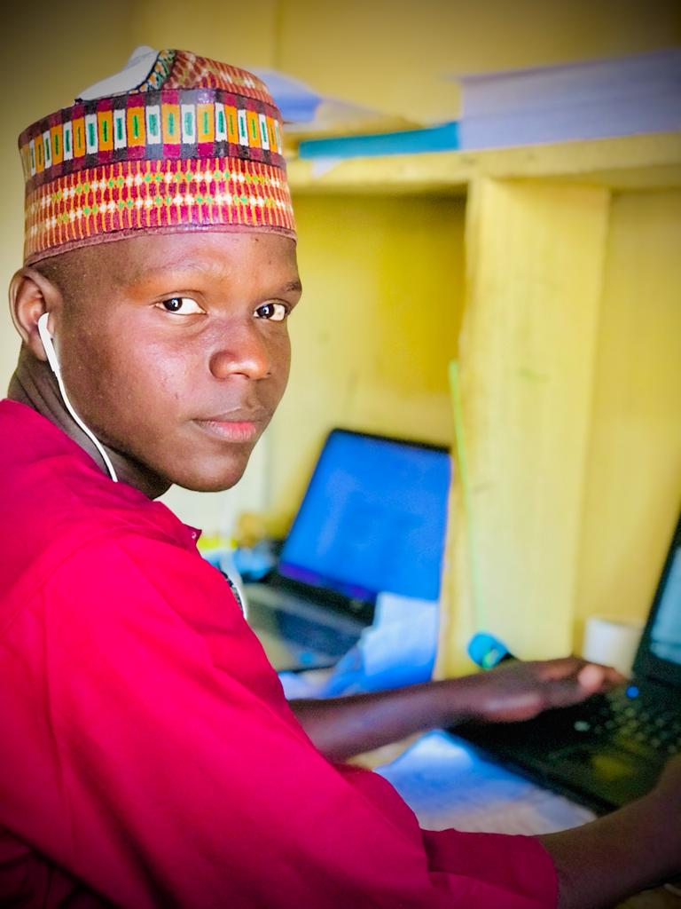

# Oswald-Avery-Group

# Introduction On Bioinformatics:

Bioinformatics is an interdisciplinary field that involves the computer science, molecular biology, mathematics and statistics to analyse the biological data. Bioinformatics also is a datascience that comprises the computer, mathematics,biology, statistics to interpret and analyzes the biological information (data).
   However, Dayhoff is known as the founder of bioinformatics. This she
did by pioneering the application of mathematics and
computational techniques to the sequencing of proteins and
nucleic acids and establishing the first publicly available
database for research in the area.
   Bioinformatics has the several components which includes the following:
   (1) computer 
   (2)internet
   (3) Operating system: Ubuntu (e.g xbunto, pedora). e.t.c.
   (4) python programme
   (5) R-programme.


# information about the group:(OSWALD AVERY GROUP 3):
Oswald-Avery has discovered  that proteins
were not the source of genetic material in the cell, but DNA .
The discovery was made while working at the Rockefeller
Institute, where he was appointed specifically to the
pneumonia research program so that he could focus entirely
on pneumococcus bacteria.
This group (i.e OSWALD-AVERY GROUP 3) we collaborately work on this assignment from the initial step to final according to the instructions given, where each member of this group used his own programming language( e.g R,Python,matlab,C#,c++,perl) to worked with.Finally we finished our work collectively and generated our bash script and CVS files at the end as instructed.


# contributors Details: 

# Name : Mudansiru Hussaini 
Matric no: BASUG/UG/BMS/ANA/21/1916
Interested Area : GENOMICS
Email: mundansiruhussaini@gmail.com
Phone : 09043010480


# Name:IBRAHIM UMAR FARUOQ
Email:IUMARFAROUQ2020@GMAIL.COM
AREA OF INTEREST: “Systems Biology”
Matric no : ANA/21/3307
Phone no:0 803 439 0275


# Name: Abdurrahm Muhammad Bello
Matric no: Ana/22/1895
Interested Area : PROTEOMICS
Email:abdulmbello2002@gmail.com
Phone no :+234 812 697 5602



# Name : ADAMU bako yaro
Matric no:Ana/21/1740
Email: adamubakoyari@gmail.com.
Phone no: +234 812 514 5697


# Name : khadija umar
Matric no: ANA/21/1501
Interested Area: METAGENOMICS
Phone no : +234 903 328 5253
Email: khadyummi@gmail.com


# Name : AMIRA AMINU MIRAJ
Matric no: Ana/21/1818
Email:amiramiraj006@gmail.com
Interested Area : DATA VISUALISATION 
Phone no:08067537006


code @:
```bash
     shakefire@protonmail.com
     ```

